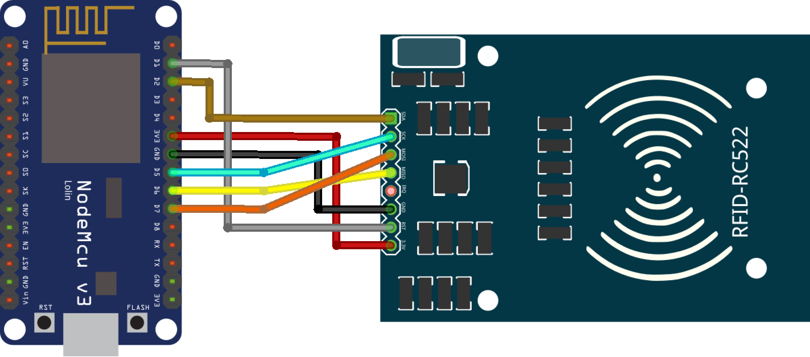
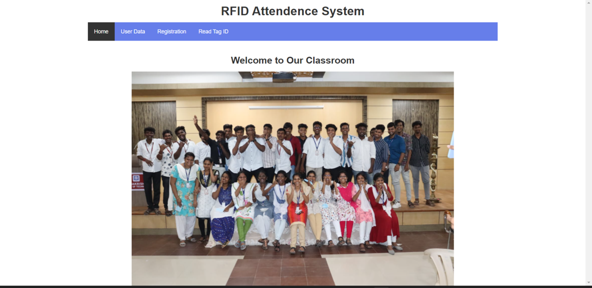
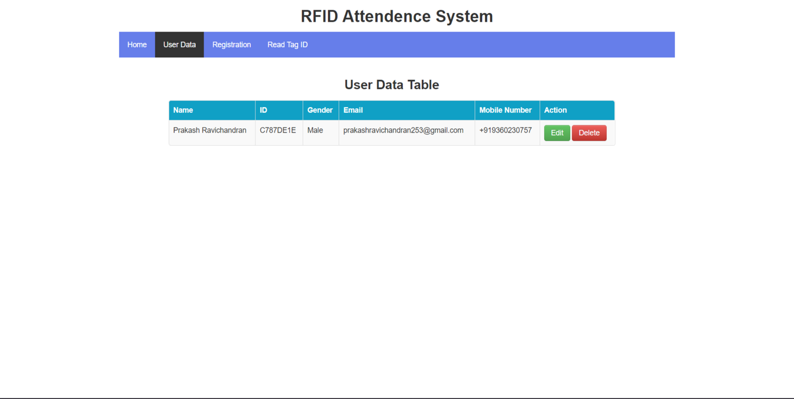
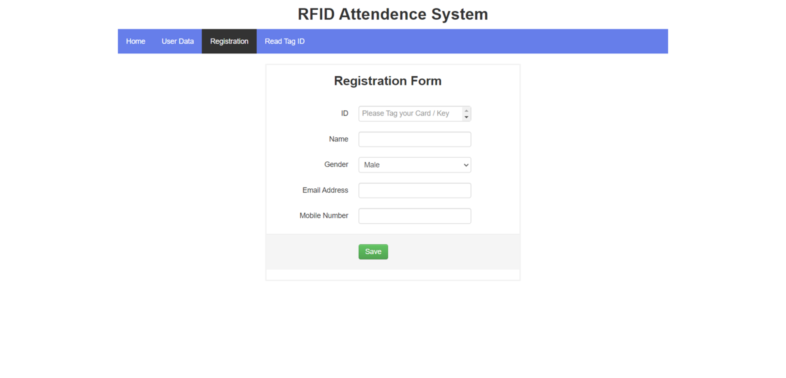
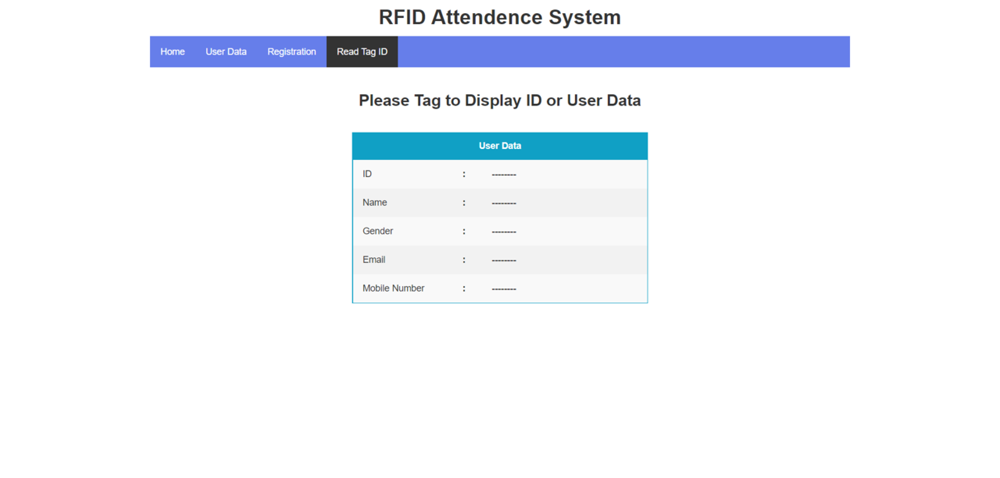

# Automatic Attendance System

The Automatic Attendance System is a project that utilizes RFID technology, NodeMCU, and XMPP to automate the attendance process. This repository contains the C++ programming code for the system.

## Features

- RFID technology for automatic identification and tracking of individuals.
- NodeMCU (ESP8266) microcontroller for data processing and communication.
- XMPP (Extensible Messaging and Presence Protocol) for real-time messaging and notifications.
- Store and manage attendance data on a remote server.

## Circuit Diagram

## Connections

### Nodemcu with RFID RC522

| Nodemcu ESP8266 | RFID RC522 |
| --------------- | ---------- |
| D2              | SDA/SS     |
| D5              | SCK        |
| D7              | MOSI       |
| D6              | MISO       |
| GND             | GND        |
| D1              | RST        |
| 3V/3V3          | 3.3V       |

**Download required libraries for NodeMCU**

## Web Preview

## Prerequisites

To run the Automatic Attendance System, you'll need the following:

- RFID reader and tags
- NodeMCU (ESP8266) microcontroller
- XMPP server for messaging and notifications
- C++ compiler (such as GCC or Clang)
- Arduino IDE or a similar development environment

## Installation

1. Clone this repository: `git clone https://github.com/PrakasRavichandran/Automatic-Attendance-System.git`
2. Connect the RFID reader to the NodeMCU board as per the hardware setup instructions.
3. Set up and configure the XMPP server for messaging and notifications.
4. Open the project in your preferred C++ development environment.
5. Configure the necessary parameters such as WiFi credentials and XMPP server details in the code.
6. Compile and upload the code to the NodeMCU board.

## Usage

1. Power on the Automatic Attendance System.
2. The RFID reader will detect the RFID tags in proximity.
3. The NodeMCU board will process the tag data and communicate with the XMPP server.
4. The attendance data will be stored on the remote server and can be accessed as required.

## Contributing

Contributions are welcome! If you'd like to contribute to the Automatic Attendance System, please follow these steps:

1. Fork this repository.
2. Create a new branch: `git checkout -b my-feature`
3. Make your modifications and improvements.
4. Commit your changes: `git commit -am 'Add my feature'`
5. Push to the branch: `git push origin my-feature`
6. Submit a pull request.

## License

This project is licensed under the [MIT License](LICENSE).

## Contact

If you have any questions, suggestions, or feedback, please feel free to reach out to me at [Instagram](https://www.instagram.com/prakashravichandrann/).

*We hope you find the Automatic Attendance System useful and efficient!*

